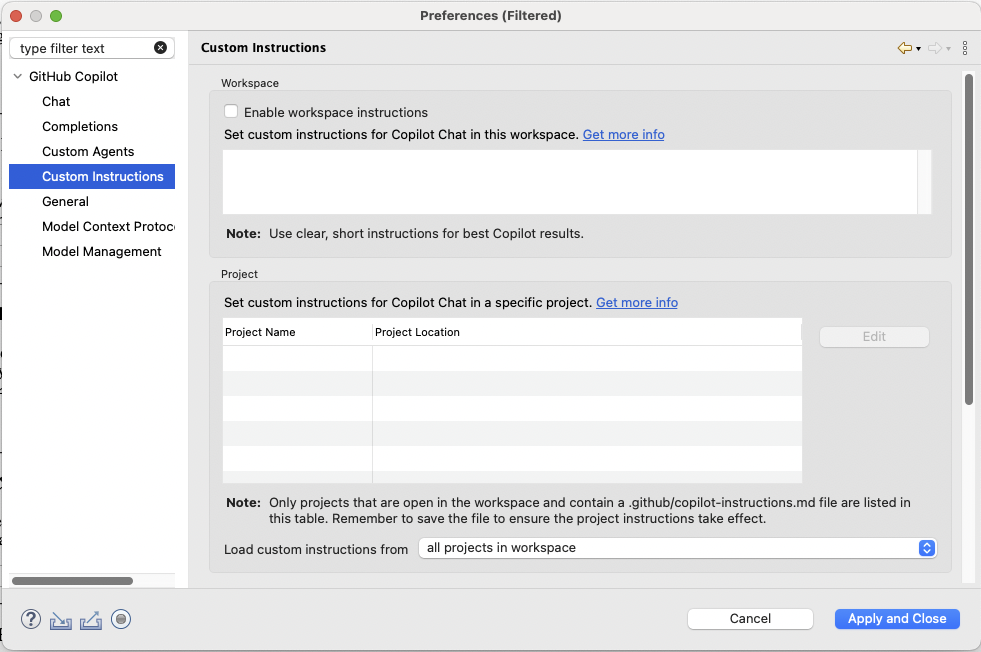
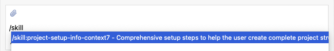
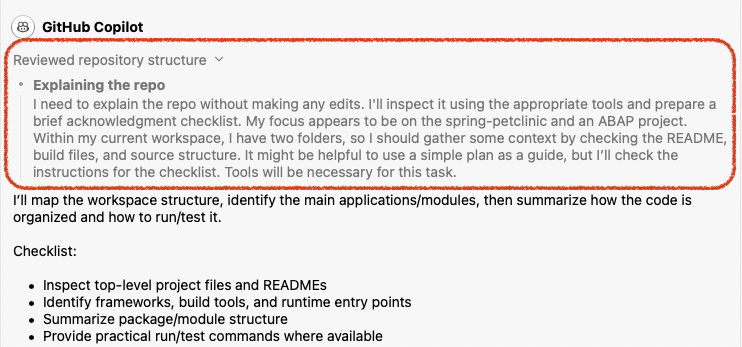
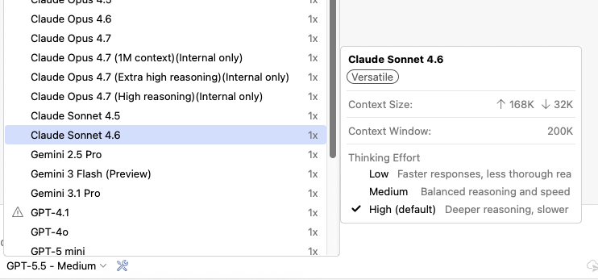

# GitHub Copilot 0.18.0 Release Notes

### Prepare for the Upcoming Usage-Based Billing
Starting from this version, we have added internal support for the [upcoming usage-based billing experience](https://github.blog/news-insights/company-news/github-copilot-is-moving-to-usage-based-billing/), including experience updates to the usage panel, usage notifications, and model picker. These changes will become visible once usage-based billing is rolled out.

Clients using older plugin versions will continue to function. However, the billing and usage experience may not be optimal and may not accurately reflect the latest usage-based billing experience.

---

### Custom Instructions Loading Preference
A new Copilot preference lets you control how a chat's custom instructions are loaded. Tailor when and how your project-specific or personal instructions are picked up by Copilot, giving you finer control over the context that shapes each conversation. By default, custom instructions are loaded from **all projects** in your Eclipse workspace; switch to **Referenced projects** to only load instructions from projects whose files or folders are referenced in the current chat.

---

### Skills and Prompt Files
Copilot for Eclipse now supports skills and prompt files. Define reusable prompts and skills to streamline your workflows — invoke them on demand to apply consistent instructions and patterns across your chats. Persist your skill files under `<workspace>/.github/skills/` (for example, `.github/skills/my-skill/SKILL.md`) and prompt files under `<workspace>/.github/prompts/` (e.g. `my-prompt.prompt.md`) so they're picked up automatically.

To trigger a skill or prompt in chat, type `/` in the chat input box to open the slash command picker.

---

### Thinking Blocks in Chat View
For models that support reasoning, the chat view now displays thinking blocks so you can follow Copilot's reasoning process alongside its final response. Expand or collapse the blocks to dive into the details or keep the view focused on results.

---

### Selectable Thinking Effort
You can now choose the thinking effort level for supported models. Dial the reasoning depth up for complex problems or keep it light for quick tasks — giving you control over the trade-off between latency and answer quality.

---

# GitHub Copilot 0.17.0 Release Notes

### GitHub Copilot for Eclipse Is Now Open Source
We're thrilled to share that GitHub Copilot for Eclipse is now open source! The full source code is available on GitHub at [microsoft/copilot-for-eclipse](https://github.com/microsoft/copilot-for-eclipse). Browse the code, file issues, and send pull requests — we'd love to build the plugin together with the Eclipse community. Your feedback and contributions help shape what comes next.

---

### Refreshed Chat View with a New Combo Picker
The chat view has been refreshed with a brand-new combo picker for selecting chat modes and models, with more information surfaced for each model.

---

### Session Context Window Usage at a Glance
Ever wonder how much of the conversation's context window has been consumed? The chat view now shows a context size donut indicator alongside the input area, with a popup that breaks down token usage for the current session. Auto compression is coming next.

---

### Custom Models (BYOK) for Copilot Business and Enterprise
Bring Your Own Key (BYOK) is now available to GitHub Copilot Business and Enterprise users — in addition to Individual users — when enabled by their organization. Once your organization turns it on, you can configure your own API keys for supported providers and use the custom models directly in Copilot chat in Eclipse. If you don't see custom models enabled, reach out to your organization's administrator to turn the feature on.

---

### Better ABAP Support
This release brings improved support for ABAP development in Eclipse. Copilot now provides more accurate and context-aware chat responses for ABAP projects, and it can read directories and search within the locally cached files.

---

### 

# GitHub Copilot 0.16.0 Release Notes

### Tool Calling in Ask Mode

Ask Mode now supports tool calling. When a question requires additional context, Copilot automatically invokes relevant tools — such as listing directories, searching for files, and reading file contents — to gather the information needed to provide an accurate response. Tools invoked in Ask Mode are read-only and will not modify your codebase.

---

### Redesigned Selectors and Chat Input Area

- **Mode and Model Selectors**: The chat mode and model selectors have been redesigned to surface more information at a glance. The updated layout includes icons and descriptions, making it easier to identify the capabilities and warnings associated with each option.

- **Chat Input Area**: The chat input area has been refined with a cleaner, borderless button design for a more streamlined appearance.

---

### Syntax Highlighting in Chat

Code snippets in Copilot's chat view now render with full syntax highlighting. Code blocks in responses are automatically highlighted based on the detected language, improving readability and making it easier to follow along with code suggestions and explanations.

